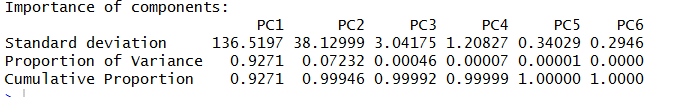

# Проверка гипотез 
1. гипотеза о распределении номинативной переменной - наше империческое распределение частот отличается от заданного теоретического распределения
 нулевая гипотеза (все группы встречаются равно вероятно)
2. гипотеза о взаимосвязи двух номинативных переменных

наблюдаемые частоты некоторого номинативного признака - градации O (observed)

ожидаемые значения E (expected)

Расстояние хи-вадтрат Пиросона - охарактеризовывает на сколько сильно отклоняются налюдаемые частоты от ожидаемых

# Распределение хи-квадрат Пирсона

Распределение хи-квадтрат с k степенями свободы - это распределение суммы квадратов k независимых стандартных нормальных случайных величин.

>Теперь рассчитаем p-уровень значимости для нашего примера с игральной костью. Напомню, что мы получили следующие значения наблюдаемых частот (от единички до шестерки):

>10, 10, 10, 5, 10, 15 

>Проверьте нулевую гипотезу о том, что эмпирическое распределение частот не отличается от равномерного. В поле для ответа введите получившийся p-уровень значимости. 

>Ссылка на калькулятор p-уровня значимости: https://gallery.shinyapps.io/dist_calc/.

x2 = 5^2/10 + 15^2/10 = 2.5 + 22.5 = 25
число степеней свободы = 5

> Вернемся к нашему примеру с политическими партиями! Проверьте гипотезу о том, что в ГС нет никаких различий в предпочтениях трех партий. Введите в поле для ответа получившееся значение статистики хи-квадрат с точностью хотя бы до одной цифры после запятой.

df = 2

n = 90

x2 = (10-30)^2/30 + (30-30)^2/30 + (50-30)^2/30 = 26.66666

> Недавно я пришел на лекцию в Институт биоинформатики и обнаружил, что в группе различное число студентов женского и мужского пола: 15 юношей и 9 девушек. Возможно, кого-то это и могло бы оставить равнодушным, а я вот сразу взял лист бумаги и ручку, чтобы проверить гипотезу о том, что распределение частот девушек и юношей не отличается от равномерного в генеральной совокупности биоинформатиков!

>Давайте сверим наши результаты. Введите в поле для ответа получившийся у вас p-уровень значимости.

df = 1

n = 24

x2 = 9/12 + 9/12 = 1.5
X-squared = 1.5, df = 1, p-value = 0.2207

> В 2013 году Эдвард Сноуден передал СМИ секретную информацию АНБ, касающуюся слежки американских спецслужб за информационными коммуникациями между гражданами. Однако его поступок вызвал неоднозначную реакцию в обществе. Исследовательский центр USA TODAY провел опрос 1500 граждан США с целью выяснить, воспринимают ли они поступок Сноудена как положительный или отрицательный. 53% опрошенных респондентов оценили разоблачение положительно.

> При помощи теста хи-квадрат проверьте нулевую гипотезу о том, что в генеральной совокупности распределение отношения к поступку Сноудена является равномерным, то есть 50 на 50.

> Введите в ответ получившийся p-уровень значимости для проверки этой гипотезы. 

n = 1500

df = 1

data:  c(795, 705)

X-squared = 5.4, df = 1, p-value = 0.02014

# Анализ таблиц сопряженности

> В таблице представлены результаты эксперимента, направленного на проверку гипотезы о взаимосвязи двух номинативных переменных с двумя градациями. Рассчитайте ожидаемые частоты для проверки нулевой гипотезы о независимости двух переменных X и Y.

>В поле для ответа напишите максимальное значение из четырех ожидаемых частот.

| <!-- -->   | <!-- --> 
|------------|----------
| 15 * 16 / 36 | 21 * 16 / 36  
| 15 * 20 / 36 | 21 * 20 / 36  

| <!-- -->   | <!-- --> 
|------------|----------
| 6.666667 | 9.333333  
| 8.333333 |  11.66667  

m <- rbind(c(10, 6), c(5, 15))

res <- chisq.test(m)

res$expected

# Требования применения критерия Пирсона

1. Все наблюдения независимы
2. Минимальное кол-во наблюдейний в каждой из ячеек должно быть больше 5

> Перед знаком стоп некоторые водители останавливаются полностью, другие лишь сбавляют скорость, но некоторые не останавливаются вообще. Важнейший вопрос, есть ли взаимосвязь между полом и стилем вождения автомобиля!  Ниже представлена таблица сопряженности данных исследования, посвященного этому вопросу. 

 
> Чему равняется число степеней свободы в нашем случае?

(2-1) * (3-1) = 2

> Проверьте нулевую гипотезу о взаимосвязи стиля вождения и пола водителя. Введите получившейся p - уровень значимости.

X-squared = 0.95441, df = 2, p-value = 0.6205

# Точный критерий Фишера

# Логистическая регрессия

odds = p / (1 - p)
odds = положительные исходы / отрицательные исходы

intersept = ln(odds) logit - натуральный логарифм от шансов

вероятность p = exp(intercept) / 1 + exp(intercept) 

# Непараметрические методы

Самым популярным непараметрическим критерием для сравнения двух групп является U-критерий Манна — Уитни. Логика данного критерия заключается в том, что вместо сравнения средних значений в двух выборках критерий сравнивает сумму рангов (не медианы, как многие думают). Мы сначала упорядочиваем все данные, затем рассчитываем сумму рангов в каждой из групп.

Затем для каждой из выборок рассчитывается показатель:

Наименьшее из полученных значений и выступает в качестве статистики теста. Легко показать, что при условии верности нулевой гипотезы распределение этой статистики подчиняется нормальному распределению, где 

  

что и позволяет нам рассчитать вероятность получить наблюдаемые или еще более выраженные различия суммы рангов.

Разумно применять вместо t - теста: 

1. Распределения хотя бы в одной из выборок значительно отличается от нормального. 
2. Есть заметные выбросы в данных. 
3. В некоторых задачах мощность теста даже выше, чем t критерия (например, когда обеих выборках наблюдается заметная асимметрия в одинаковом направлении). 

Неразумно применять: 

1. Выборки разного размера, с различным направлением асимметрии.

Критерий Краскела-Уоллиса

# Кластерный анализ

k-means

качество кластеризации определяется
по общей внутригрупповой сумме квадратов

с увеличением кол-ва центроидов уменьшается внутригрупповая сумма

иерархическая кластеризация:
- метод ближайшего соседа
- метод одиночной связи

# анализа главных компонент (PCA)

при наличии кореляции между переменными их можно заменить новой интегративной перменно - главной компонентой 

чем больше кореляция между двумя переменными, тем меньше информации мы потеряем при переходе к новой главной компоненете

# Факторный анализ 

метод понижения размерности данных. 

Идея метода заключается в том, что возможно некоторые переменные могут быть сгруппированы в факторы. 

Фактор - это некоторая латентная переменная, которая объединяет исходные переменные в данных.

Например, если бы в нашей выборке каждый испытуемый характеризовался весом, ростом, силой, знаем английского, знанием немецкого и знанием русского языка. То вероятно, мы смогли бы выделить два фактора: "физическая подготовка" и "знание языков". Разумеется, первые три определяли бы первый фактор, а оставшиеся переменные - второй  фактор.

Давайте посмотрим на основные результаты факторного анализа, примененного к нашим данным swiss для того, чтобы выделить два фактора:

Основные результаты факторного анализа - это факторные нагрузки для каждой переменной. Проводя аналогии с анализом главных компонент, мы можем выяснить какие переменные в большей степени взаимосвязаны между собой и влияют на значения первого фактора, а какие переменные напротив группируются друг с другом и влияют на второй фактор.

В данной таблице видно, что первый фактор - это низкие значения по переменной Fertility, Agriculture но высокие значения переменных Examination и Education. Второй фактор - это наоборот высокие значения по переменным  Fertility, Agriculture, низкие по переменной Examination и максимальный вклад вносит переменная Catholic - то есть процент католического населения.

Таким образом, можно предположить, что за факторизацию наших переменных отвечает два фактора - преобладание протестантского или католического населения.